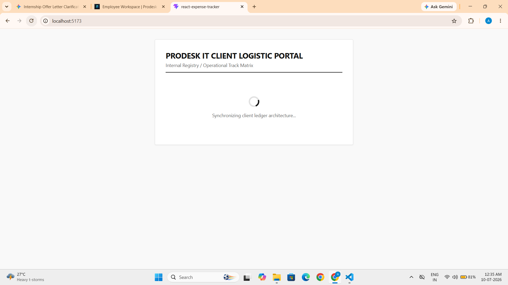
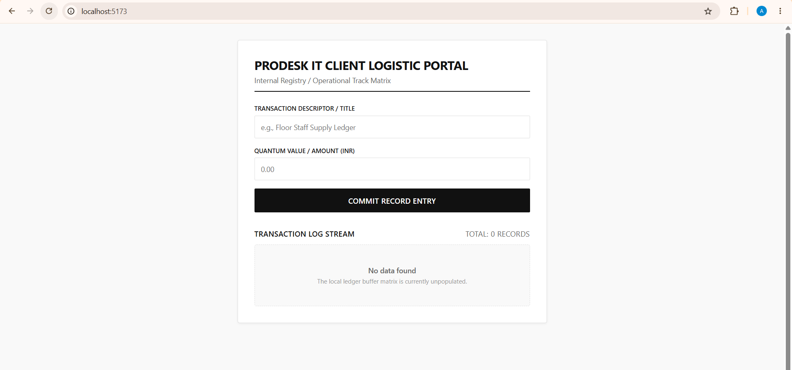
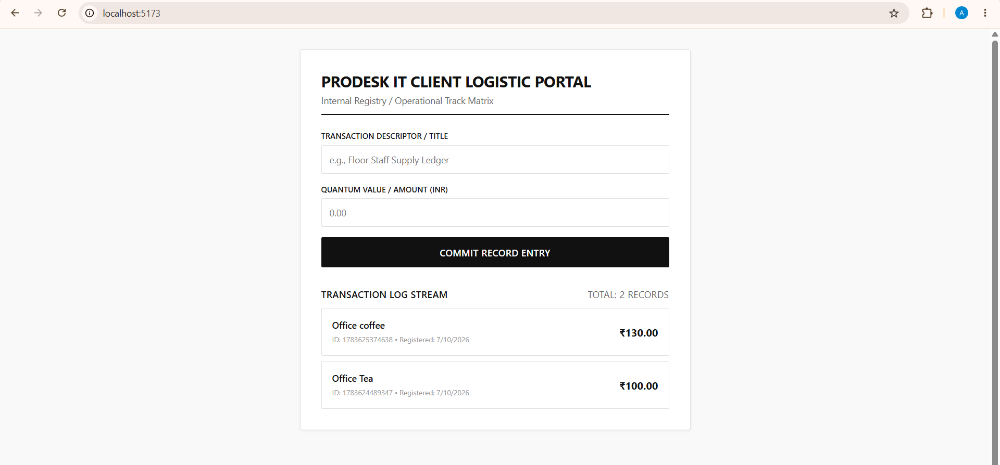
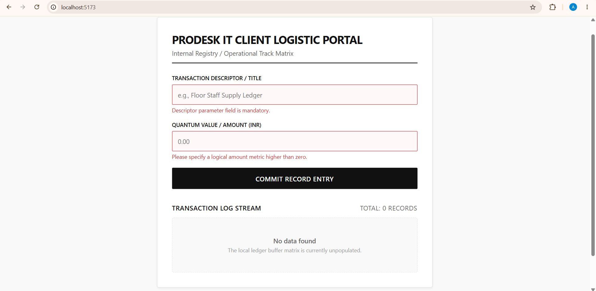
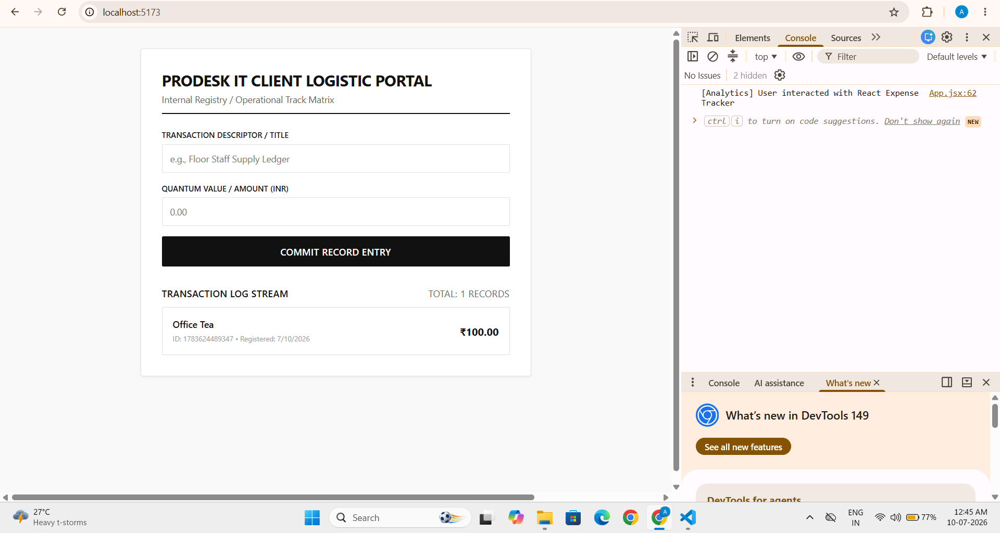

# Enterprise Client Logistic Portal - React Expense Tracker

An enterprise-grade, high-performance execution ledger built strictly tailored to the technical requirements document (TRD) for automated infrastructure monitoring and staff utility management.

## 🛠️ Tech Stack & Constraints

- **Core Library:** React.js (Hooks: `useState`, `useEffect`)
- **Scaffolding:** Vite Ecosystem
- **Styling Architecture:** Monochromatic Corporate Design System
- **State Management Constraint:** Strict Prop Drilling (Zero Redux/React-Router)

---

## 🚀 Implemented Engineering Specifications

### 1. Robust Edge-Case Handling ("Unhappy Path")

- **Empty State Buffer:** Displays a declarative, stylized `"No data found"` system message when the internal database array matrix is unpopulated, eliminating blank view vulnerabilities.

- **Simulated Latency Engine:** Includes a visual network connectivity loading state indicator to preserve accessibility benchmarks on spotty/3G connections.

- **Malformed Entry Prevention:** Interactive validation intercepts invalid inputs, aborting dispatch cycles and highlighting offending form controls dynamically in corporate red.

### 2. Enterprise Quality Metrics (NFR Compliance)

- **Telemetry Simulation:** Dispatches real-time structured metric feedback strings to the local terminal system stream console (`[Analytics] User interacted with React Expense Tracker`) upon completion of primary action routines.

- **Sanitization Protocol:** Enforces automated programmatic cross-site scripting (XSS) input filtration to neutralize script injection attack vectors before updating local memory array fields.

- **Accessibility Infrastructure:** Implements standard structural header semantic hierarchies (`<h1>`, `<h2>`), functional ARIA state indicators (`aria-invalid`, `aria-required`), and keyboard interactive accessibility focus loops.

---

---

## 📷 System Screenshots

### 1. Simulated Latency Engine / Loading Status

---

### 2. Operational Log - Empty Buffer State

---

### 3. Active Transaction Stream (Data Consistency)

---

### 4. Malformed Input Interception (Validation Constraint)

---

### 5. Successful Entry Dispatch & Live Telemetry Log

---

## 🔗 Live Demo
**View the site live here:** [https://react-expense-tracker-red.vercel.app/]

---
