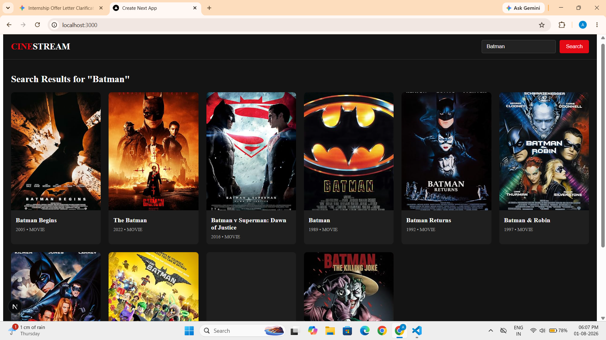
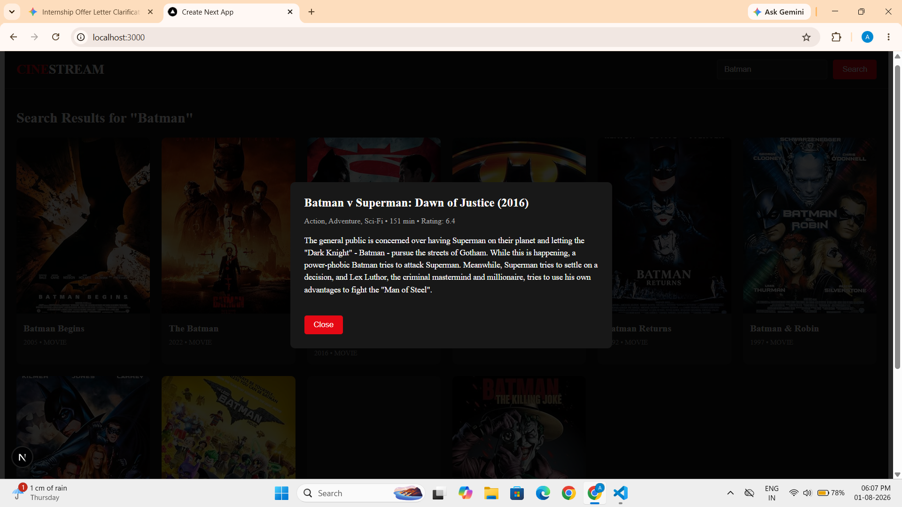
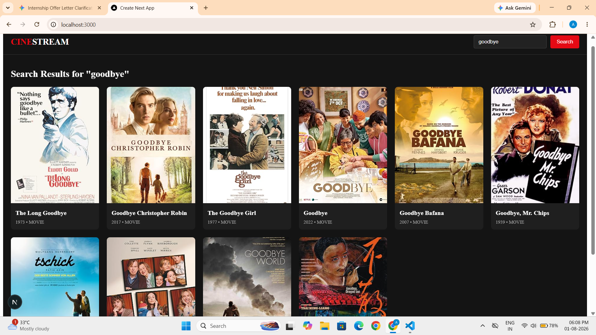
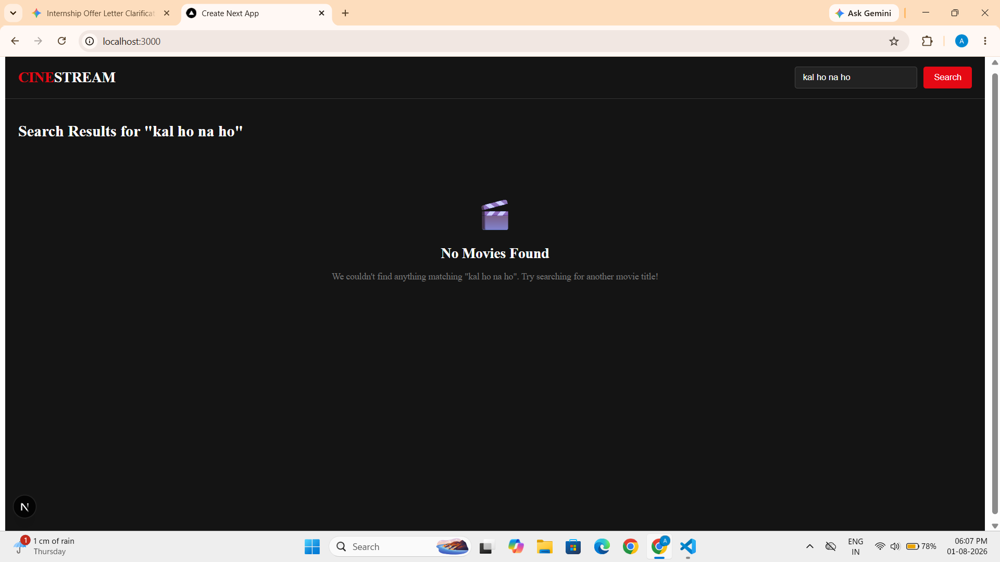

# 🎬 CineStream (Next.js Edition)

> **Sprint 9 Assignment** | **Track A: Frontend Specialist**  
> *Migrating a React.js SPA to Next.js 14 App Router with Server-Side Fetching, Dynamic Search, and Modal Integration.*

---

## 📌 Project Overview :

**CineStream** is a modern, responsive movie search and discovery web application built using **Next.js (App Router)** and integrated with the **OMDb REST API**. 

This project demonstrates the complete migration from a client-side React single-page application (SPA) to a server-optimized Next.js architecture, featuring dynamic route rendering, client interactivity, robust error handling, and clean modular component design.

---

## ✨ Key Features :

* 🚀 **Next.js App Router Architecture:** Organized cleanly under `src/app` using React Server Components (RSC) and explicit `'use client'` boundaries.
* 🔍 **Real-time Movie Search:** Instant movie search powered by OMDb API with integrated loading states.
* 🎬 **Interactive Movie Details Modal:** Clickable movie cards that open a detailed modal overlay displaying full plot summaries, runtime, genres, and IMDb ratings.
* 🛡️ **Empty State Handling:** User-friendly fallback screen ("No Movies Found") when search queries return empty or invalid results.
* 🎨 **Netflix-inspired Dark UI:** Sleek, high-contrast dark theme optimized for movie browsing.

---

## 🛠️ Tech Stack & Tools :

* **Framework:** Next.js 14+ (App Router)
* **Library:** React 18+
* **Language:** JavaScript (ES6+)
* **API:** OMDb REST API (`https://www.omdbapi.com/`)
* **Styling:** CSS-in-JS / Inline Styles (Modular design)
* **Version Control:** Git & GitHub

---

## 📁 Project Structure :

```text
cine-stream-next/
├── public/
│   └── favicon.ico
├── src/
│   ├── app/
│   │   ├── globals.css          # Global styling & dark background
│   │   ├── layout.js            # Root App Layout
│   │   ├── page.js              # Main Home Page (State & API integration)
│   │   └── page.module.css
│   └── components/
│       ├── MovieCard.jsx        # Poster grid card component
│       ├── MovieDetailsModal.jsx # Detailed plot & stats overlay
│       └── Navbar.jsx           # Top header & search bar
├── .env.local                   # Environment variables (API Key)
├── package.json
└── README.md
```

---

## 🚦 Getting Started :

**Follow these steps to run the project locally on your machine:**

### 1. Prerequisites
Make sure you have Node.js (v18 or higher) installed.

---

### 2. Installation
Clone the repository and navigate into the project directory:

```bash
cd cine-stream-next
npm install
```

---

### 3. Environment Setup
Create a .env.local file in the root directory and add your OMDb API Key:

```Code snippet
NEXT_PUBLIC_OMDB_API_KEY=f88aeb0f
```

---

### 4. Run Development Server
```bash
npm run dev
```

**Open http://localhost:3000 in your browser to view the live app.**

---

## Phases Completed (Frontend Track):

**Phase 1:** Setup & Porting: Next.js App Router initialization and clean component migration with proper 'use client' declarations.

**Phase 2:** Data Fetching Integration: Connected OMDb API with dynamic grid rendering for popular movies.

**Phase 3:** Search & Modal State: Added real-time query search, modal overlays for detailed plot fetching, and empty search result fallbacks.

---

## 📸 Application Screenshots :

### 1. Main Search & Exploration Workspace


---

### 2. Interactive Movie Details Modal


---

### 3. Search Results Grid Layout


---

### 4. Empty Search State & Fallback UI


---

## 🔗 Live Demo
**View the site live here:** [Insert your Vercel or Netlify link here]

---